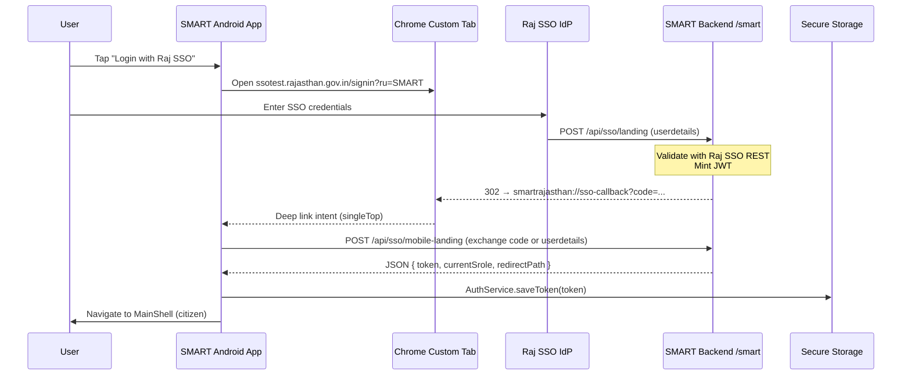

# SMART Rajasthan — Mobile SSO Design (Activity 3.1)

**Status:** Approved approach for Phase 3 implementation  
**Date:** 27 June 2026  
**Owners:** Mobile + Backend + SSO Coordinator  
**Depends on:** Phase 2 (`AuthService`, `SmartApiClient`)  
**Unblocks:** 3.2 (redirect URI registration), 3.3 (backend JSON), 3.5–3.8 (mobile implementation)

---

## 1. Problem statement

The web app authenticates via **Rajasthan SSO** using a **browser cookie**:

1. User opens Raj SSO sign-in (`signin?ru=SMART`).
2. Raj SSO **POSTs** an encrypted `userdetails` token to SMART backend `/smart/api/sso/landing`.
3. Backend validates with Raj SSO REST APIs, mints a JWT, sets `Set-Cookie: jwt=...`, and **HTTP-redirects** to the web portal (`/citizen`, `/admin`, etc.).
4. The Next.js app reads the JWT from `document.cookie`.

**Mobile cannot rely on cookies.** The Flutter app must:

- Open Raj SSO in a trusted browser surface.
- Receive the SSO result back into the app (deep link / App Link).
- Obtain the SMART JWT as a **string** and store it via `AuthService` (secure storage + `Authorization: Bearer`).

---

## 2. Decision summary

| Topic | Decision | Rationale |
|-------|----------|-----------|
| **Browser surface** | **Chrome Custom Tab** (primary) | Google-recommended for federated login; visible URL bar; shares user’s Chrome session on device. |
| **Fallback** | In-app WebView | Only if Custom Tab unavailable on a device; document security review before prod. |
| **JWT delivery (prod)** | **Backend JSON endpoint** `POST /api/sso/mobile-landing` (task **3.3**) | Avoids parsing `Set-Cookie` in mobile; explicit `{ token, currentSrole, redirectPath }`. |
| **JWT delivery (UAT interim)** | `POST /api/sso/getSandBoxToken` (task **3.4**) or parse `Set-Cookie` from `/sandboxlanding` (task **3.7a**) | Already implemented on backend; mirrors `SsoSandbox.tsx`. |
| **Callback into app** | **Custom URI scheme** + optional **HTTPS App Link** (task **3.6**) | Raj SSO / backend redirect must land in the app after login. |
| **Citizen-only v1** | Force `X-Current-Role: CITIZEN` on API calls | Mobile v1 is citizen panel only (activity 2.13). |

Constants live in `lib/config/sso_config.dart`.

---

## 3. Reference — current web & backend behaviour

### 3.1 Web entry URL (UAT)

```
https://ssotest.rajasthan.gov.in/signin?ru=SMART
```

Production: `https://sso.rajasthan.gov.in/signin?ru=SMART`

(`smart_frontend/.env` → `NEXT_PUBLIC_RAJSSO_URL`)

### 3.2 Backend SSO endpoints (verified `SSOController.java`)

| Endpoint | Method | Response today | Mobile use |
|----------|--------|----------------|------------|
| `/api/sso/landing?userdetails=` | POST | `302` + `Set-Cookie: jwt` + redirect to web | Prod exchange after SSO (needs 3.3 or 3.7a) |
| `/api/sso/sandboxlanding?userdetails=&ssoId=` | POST | JSON `{ status, redirectUrl }` + cookie if `Accept: application/json` | UAT SSO test |
| `/api/sso/getSandBoxToken?userdetails=` | POST | JSON `{ token }` | **UAT dev / Phase 4** (no real SSO) |
| `/api/sso/signout` | POST body `{ userdetails }` | Raj SSO sign-out proxy | Logout (task 3.9) |

### 3.3 JWT claims used by mobile

Decoded in `AuthSession` (activity 2.7): `ssoId`, `smUserId`, `Name`, `currentSrole`, `panelTypes`, `jfId`, `sub` (encrypted userdetails for logout).

---

## 4. Target production flow



**Notes:**

- Exact callback query parameters depend on what Raj SSO team registers in **3.2** (may be `userdetails` directly or a one-time `code`).
- Until **3.3** exists, interim prod path uses **3.7a**: mobile POSTs to `/landing` with `Accept: application/json` and extracts JWT from `Set-Cookie` response header (fragile — avoid for prod cutover).

---

## 5. UAT / development tracks (parallel)

### Track A — Real SSO on UAT (after 3.2 redirect URI)

Same as §4 but:

- Raj SSO UAT host: `ssotest.rajasthan.gov.in`
- Backend landing: `/api/sso/sandboxlanding` **or** `/landing` per SSO registration
- Callback scheme: `smartrajasthan://sso-callback`

### Track B — Sandbox token (no Raj SSO UI) — **already supported**

For Phase 4 screen work without waiting for 3.2:

```
POST /smart/api/sso/getSandBoxToken?userdetails=sandbox
→ { "token": "<jwt>" }
→ AuthService.saveToken(token)
```

Implemented in `SmartApiService.fetchSandboxToken()` and UAT connectivity test (2.12).

---

## 6. Deep link & Android manifest (preview for 3.6)

**Custom scheme (register in 3.2 with SSO team as return URL target):**

```
smartrajasthan://sso-callback
```

**Optional App Link (production hardening):**

```
https://smart.rajasthan.gov.in/mobile/sso-callback
https://smarttest.rajasthan.gov.in/mobile/sso-callback
```

`AndroidManifest.xml` intent-filter (to be added in 3.6):

```xml
<intent-filter android:autoVerify="true">
  <action android:name="android.intent.action.VIEW" />
  <category android:name="android.intent.category.DEFAULT" />
  <category android:name="android.intent.category.BROWSABLE" />
  <data android:scheme="smartrajasthan" android:host="sso-callback" />
</intent-filter>
```

`applicationId`: `smart.rajasthan.gov.in` (activity 1.5).

`launchMode`: keep `singleTop` on `MainActivity` so callback reuses running app.

---

## 7. Chrome Custom Tab vs WebView

| | Custom Tab | In-app WebView |
|---|------------|----------------|
| User trust | Address bar shows Raj SSO domain | Easy to spoof |
| Play policy | Preferred for login | Scrutiny if handling credentials |
| Cookie isolation | Separate from WebView jar | Isolated; still not accessible to Flutter |
| Redirect capture | `url_launcher` / `flutter_custom_tabs` + deep link | `NavigationDelegate` URL filter |
| **Verdict** | **Use for prod** | Dev fallback only |

**Package candidates (3.5):** `flutter_custom_tabs` or `url_launcher` with `LaunchMode.externalApplication` + deep link handler (`app_links` / `uni_links`).

---

## 8. Backend work request (activity 3.3)

Add (or extend `/landing`):

```
POST /smart/api/sso/mobile-landing
Content-Type: application/x-www-form-urlencoded OR JSON
Body: userdetails=<token from Raj SSO>  (same as web)

Response 200 application/json:
{
  "token": "<jwt>",
  "currentSrole": "citizen",
  "redirectPath": "/citizen"
}
```

Requirements:

- Same validation path as `/landing` (`SSODetails.getTokenDetails`, role resolution, profile lookup).
- **No dependency on browser cookies** for mobile clients.
- Optional: accept `redirect_uri=smartrajasthan://sso-callback` and return `302` to app with short-lived exchange code instead of putting JWT in URL (preferred security).

Citizen app should reject non-citizen roles or map to citizen panel only (product decision — default: allow login but force `X-Current-Role: CITIZEN`).

---

## 9. SSO Coordinator work request (activity 3.2)

**Submission package:** `tool/SSO_REDIRECT_URI_REGISTRATION.md` (email template, URIs, certificate fingerprints, checklist).

Register with Raj SSO team:

| Item | Proposed value |
|------|----------------|
| Application | SMART Rajasthan Android |
| Package / applicationId | `smart.rajasthan.gov.in` |
| Return URL (custom scheme) | `smartrajasthan://sso-callback` |
| Return URL (HTTPS, optional) | `https://smart.rajasthan.gov.in/mobile/sso-callback` |
| Service code | `ru=SMART` (existing web registration) |
| Environments | UAT (`ssotest.rajasthan.gov.in`) + Production (`sso.rajasthan.gov.in`) |

**Lead time:** 1–2 weeks (external). Phase 4 may proceed on **Track B** sandbox token meanwhile.

---

## 10. Mobile implementation map (Phase 3)

| Task | What to build |
|------|----------------|
| **3.1** ✅ | This document + `lib/config/sso_config.dart` |
| **3.2** | SSO team registration (no code) |
| **3.3** | Backend JSON endpoint (backend repo) |
| **3.4** | Wire login debug / dev screen to `getSandBoxToken` |
| **3.5** | `SsoLoginScreen` — open Custom Tab, show loading / error |
| **3.6** | Manifest deep link + `app_links` listener in `main.dart` |
| **3.7** | `SsoAuthService.completeLogin(userdetails)` → mobile-landing / landing |
| **3.7a** | Fallback: parse `Set-Cookie` from `/sandboxlanding` |
| **3.8** | Remove mock `Navigator` login bypass in release; gate on `AuthService` |
| **3.9** | Logout → `signout` + clear storage |
| **3.10** | Already partial via `SessionGuard` + 401 interceptor (2.11) |

---

## 11. Security considerations

1. **Never log** full `userdetails` or JWT in release builds.
2. Store JWT only in `flutter_secure_storage` (`AuthService`).
3. Do not embed Raj SSO passwords in the app (SSO handles credentials).
4. Prefer **one-time exchange code** in deep link over JWT in query string (backend 3.3 enhancement).
5. Release builds: **disable** sandbox token button (`SsoConfig.allowSandboxTokenInRelease = false`).
6. Validate deep link host/scheme strictly before calling backend.

---

## 12. Testing checklist (for 3.11)

Formal test plan: **`tool/SSO_UAT_TEST_PLAN.md`**  
Results template: **`tool/SSO_UAT_RESULTS_TEMPLATE.md`**  
In-app runner: **Login / Drawer → SSO UAT (3.11)** → `lib/screens/sso_uat_screen.dart`

Manual cases (record pass/fail in results file):

- [ ] Custom Tab opens correct Raj SSO URL (UAT + prod) — **TC-01**
- [ ] Deep link returns to app after SSO — **TC-01**
- [ ] JWT stored; cold start restores session — **TC-02**
- [ ] Profile + dashboard load with stored token — **TC-01 + automated post-login**
- [ ] 401 clears session and shows login (3.10) — **TC-07**
- [ ] Logout calls `/signout` and clears storage (3.9) — **logout check + drawer**
- [ ] Release APK has no mock login shortcut — **TC-08**

---

## 13. Open questions for backend / SSO team

1. After Raj SSO login, does IdP POST directly to `/smart/api/sso/landing`, or to a Raj-hosted URL that forwards to SMART?
2. Can Raj SSO register `smartrajasthan://sso-callback` as a valid `ru` return target, or must callback be HTTPS only?
3. Can `/landing` accept `Accept: application/json` and return `{ token }` like `/getSandBoxToken` (minimal 3.3)?
4. Production `sso.api.redirectURL` — confirm citizen path for mobile (`/citizen` vs role-based).

---

## 14. References

| Artifact | Path |
|----------|------|
| Backend SSO controller | `smart_backend_mono/.../SSOController.java` |
| Web sandbox login | `smart_frontend/components/SsoSandbox.tsx` |
| Web Raj SSO URL | `smart_frontend/.env` → `NEXT_PUBLIC_RAJSSO_URL` |
| Mobile auth service | `lib/services/auth_service.dart` |
| Mobile env | `lib/config/env.dart` |
| SSO constants | `lib/config/sso_config.dart` |
| Project plan Phase 3 | `tool/PRODUCTION_PROJECT_PLAN.md` |
