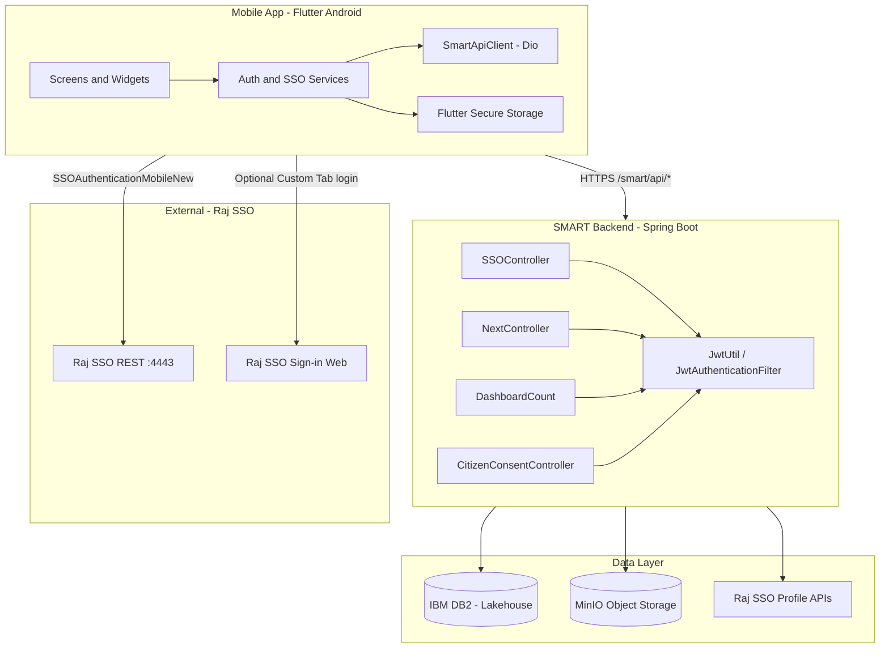
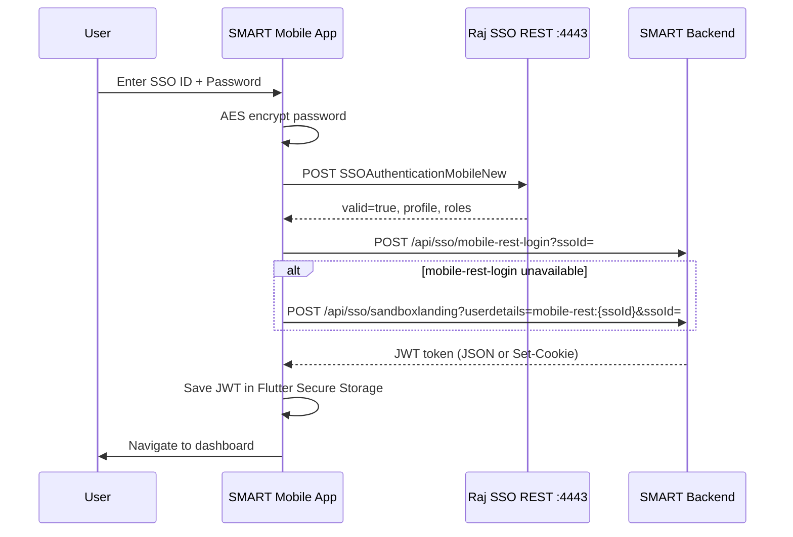

# SMART Rajasthan — Mobile Application Technical Document

**Document version:** 1.0  
**Date:** 8 July 2026  
**Scope:** Mobile app (Flutter/Android), SMART backend APIs, database, security, and authentication  
**Project:** Services Management with Artificial Intelligence and Real-Time system (SMART), Government of Rajasthan

---

## 1. Executive Summary

SMART Rajasthan is a citizen-facing mobile application that connects to the SMART monolithic backend (`smart_backend_mono`) over HTTPS. Authentication is federated through **Rajasthan Single Sign-On (Raj SSO)**. After SSO validation, the backend issues a **JWT** that the mobile app stores in **encrypted device storage** and sends on every API call as `Authorization: Bearer <token>`.

The mobile app does **not** connect to the database directly. All business data is accessed through REST APIs exposed by the Spring Boot backend.

---

## 2. System Architecture



---

## 3. Environment Configuration

All SMART API paths are prefixed with context path `/smart`.

| Environment | SMART API base URL | Raj SSO sign-in | Raj SSO REST (port 4443) |
|-------------|-------------------|-----------------|--------------------------|
| **Production** | `https://smart.rajasthan.gov.in/smart` | `https://sso.rajasthan.gov.in/signin?ru=SMART&client=mobile` | `https://sso.rajasthan.gov.in:4443` |
| **UAT** | `https://smarttest.rajasthan.gov.in/smart` | `https://ssotest.rajasthan.gov.in/signin?ru=SMART&client=mobile` | `https://ssotest.rajasthan.gov.in:4443` |
| **Dev (emulator)** | `http://10.0.2.2:8080/smart` | UAT Raj SSO host | UAT Raj SSO REST |

**Build flags (mobile):**

```powershell
# Production release
flutter build apk --release --dart-define=SMART_ENV=prod

# UAT release / debug
flutter run --dart-define=SMART_ENV=uat
```

Optional overrides: `SMART_API_HOST`, `RAJ_SSO_MOBILE_KEY`, `RAJ_SSO_CLIENT_ID`

---

## 4. Frontend (Mobile Application)

### 4.1 Platform and Framework

| Category | Technology | Version / Notes |
|----------|------------|-----------------|
| Framework | **Flutter** | SDK `>=3.0.0 <4.0.0` |
| Language | **Dart** | 3.x |
| Target platform | **Android** (primary) | `minSdk` 21; package `smart.rajasthan.gov.in` |
| Native layer | **Kotlin** | Namespace `gov.rajasthan.smart` |
| UI toolkit | **Material Design** | Flutter Material 3 widgets |
| Localization | **flutter_localizations** | English + Hindi (`lib/i18n/`) |

### 4.2 Key Libraries and Tools

| Library | Purpose |
|---------|---------|
| **dio** ^5.8 | HTTP client for SMART backend APIs |
| **flutter_secure_storage** ^9.2 | Encrypted JWT persistence (Android EncryptedSharedPreferences) |
| **encrypt** ^5.0 | AES/CBC password encryption for Raj SSO REST API |
| **flutter_custom_tabs** ^2.1 | Chrome Custom Tab for Raj SSO web sign-in (fallback flow) |
| **webview_flutter** ^4.10 | In-app WebView fallback for SSO |
| **app_links** ^6.3 | HTTPS App Links + deep link handling |
| **shared_preferences** ^2.5 | Non-sensitive preferences |
| **safe_device** ^1.1 | Root/emulator detection (release builds) |
| **flutter_launcher_icons** | App icon generation |
| **http_mock_adapter** | Unit test HTTP mocking |

### 4.3 Mobile Project Structure (high level)

| Path | Responsibility |
|------|----------------|
| `lib/config/env.dart` | Environment resolution (UAT / Prod / Dev) |
| `lib/config/sso_config.dart` | Raj SSO URLs, callback URIs, encryption constants |
| `lib/services/smart_api_client.dart` | Shared Dio client, JWT + role headers |
| `lib/services/auth_service.dart` | JWT lifecycle, secure storage |
| `lib/services/raj_sso_mobile_auth_service.dart` | Native SSO login (REST → JWT) |
| `lib/services/raj_sso_mobile_rest_client.dart` | Raj SSO `SSOAuthenticationMobileNew` client |
| `lib/services/sso_landing_service.dart` | JWT exchange via backend landing APIs |
| `lib/services/next_query_client.dart` | Generic nextquery API wrapper |
| `lib/screens/` | UI screens (login, dashboard, consent, profile, etc.) |

### 4.4 Build Tools

| Tool | Usage |
|------|-------|
| **Flutter SDK** | `flutter build apk`, `flutter test` |
| **Gradle (Kotlin DSL)** | Android packaging (`android/app/build.gradle.kts`) |
| **Android Studio / VS Code** | IDE |

---

## 5. Backend (APIs)

### 5.1 Technology Stack

| Category | Technology | Version / Notes |
|----------|------------|-----------------|
| Runtime | **Java** | 1.8 |
| Framework | **Spring Boot** | 2.7.18 |
| Packaging | **WAR** | Deployed on application server (e.g. WebSphere/Tomcat) |
| Security | **Spring Security** | Stateless JWT filter |
| ORM | **Spring Data JPA / Hibernate** | DB2 dialect |
| HTTP client | **OkHttp**, **RestTemplate** | Outbound calls to Raj SSO, Jan Aadhaar, eMitra, etc. |
| JWT | **jjwt** 0.11.5 | Token generation and validation |
| API docs | **springdoc-openapi** 1.7.0 | Swagger UI |
| PDF | **iText** 5.5.13 | Certificate generation |
| Object storage | **MinIO** 9.0.1 | Document / attachment storage |
| Build | **Maven** | `pom.xml` — artifact `gov.sws:SWS` |

**Context path:** `/smart` (all mobile API URLs are `{origin}/smart/api/...`)

**Source:** `smart_backend_mono/`

### 5.2 Backend Controller Modules

| Controller | Base path | Mobile usage |
|------------|-----------|--------------|
| `SSOController` | `/api/sso` | Login, logout, profile, JWT mint |
| `DashboardCount` | `/api/dashboard` | Citizen dashboard counts |
| `NextController` | `/api/nextquery` | Schemes, consents, lists (data lake queries) |
| `CitizenConsentController` | `/api/CitizenConsent` | Consent OTP send/validate |
| `ServiceController` | `/api/services` | Reports (department; limited mobile) |
| `EmitraController` | `/api/emitra` | Payment / certificate integrations |
| `FileStorageController` | `/api/service/s3` | Document preview/download |
| `OpenController` | `/api/open` | Public PDF endpoints |
| `JanAadhaarController` | `/api/janaadhaar` | Jan Aadhaar integrations |
| `NotificationController` | `/api/service/notification` | SMS notifications |

---

## 6. Database

The mobile app has **no direct database connection**. The backend uses:

| Environment | Database | Access method |
|-------------|----------|---------------|
| **UAT** | **IBM DB2** (Lakehouse / Watsonx BLUDB) | JDBC SSL connection |
| **Production** | **IBM DB2** and/or **Oracle** (deployment-specific) | JNDI `jdbc/swsprod` or JDBC URL |

**UAT configuration (representative):**

- Driver: `com.ibm.db2.jcc.DB2Driver`
- Dialect: `org.hibernate.dialect.DB2Dialect`
- Schema: `SWS` (Hibernate default schema)
- Connection: SSL-enabled DB2 on OCP UAT cluster

**Production configuration (representative):**

- JNDI: `jdbc/swsprod` (Oracle DB2 hybrid per deployment profile)
- Legacy Oracle URL pattern: `jdbc:oracle:thin:@//<host>:1521/SWSPROD`

**Object storage:** MinIO (ticketing attachments, documents) — configured via `ticketing.minio.*` properties.

**Data access pattern for mobile features:**

- Structured citizen/scheme/consent data → **NextQuery** (`NextController`) → DB2 lakehouse models
- SSO profile / member mapping → **SsoService** + Raj SSO REST + DB2
- Dashboard aggregates → **DashboardCountRepository** → DB2 stored logic

---

## 7. API Endpoints Used by Mobile App

> Full URL pattern: `{Env.baseUrl}{path}`  
> Example (Prod): `https://smart.rajasthan.gov.in/smart/api/sso/getProfile`

### 7.1 Authentication and SSO (SMART Backend)

| Method | Endpoint | Purpose | Auth required |
|--------|----------|---------|---------------|
| POST | `/api/sso/landing` | Production SSO callback — validate `userdetails`, mint JWT | No (`permitAll`) |
| POST | `/api/sso/sandboxlanding` | UAT / mobile-rest JWT fallback — mint JWT from `ssoId` | No |
| POST | `/api/sso/mobile-landing` | JSON JWT exchange for deep-link SSO (preferred prod path) | No |
| POST | `/api/sso/mobile-rest-login` | JWT mint after native Raj SSO REST auth | No |
| POST | `/api/sso/getSandBoxToken` | UAT dev sandbox JWT (testing only) | No |
| POST | `/api/sso/getProfile` | Citizen profile from DB (member ID / SSO ID) | Yes (JWT) |
| GET | `/api/sso/profile` | Sync Raj SSO profile to `USER_PROFILE` | SSO headers |
| POST | `/api/sso/signout` | Raj SSO sign-out proxy | No |
| POST | `/api/sso/refresh` | JWT refresh (web; cookie-based) | Cookie JWT |
| GET | `/api/sso/role-mappings` | SSO role mapping (admin/department) | Yes |

### 7.2 Raj SSO External REST API (Mobile v2.6.1)

Called **directly from the mobile app** (not through SMART backend):

| Method | URL | Purpose |
|--------|-----|---------|
| POST | `{rajSsoRestOrigin}/SSOREST/SSOAuthenticationMobileNew` | Native login — validate SSO ID + encrypted password |

**Request parameters (form-urlencoded on Production, JSON on UAT):**

| Field | Description |
|-------|-------------|
| `Application` | `SMART` (registered application name) |
| `UserName` | Raj SSO ID |
| `Password` | AES/CBC/PKCS5 encrypted password (Base64) |

**Official API reference:** `SSO_RESTAPI_MOBILE_v2.6.1`

### 7.3 Dashboard

| Method | Endpoint | Purpose |
|--------|----------|---------|
| POST | `/api/dashboard/citizenDashboardCount` | Citizen dashboard stat cards (eligible, availed, consent, etc.) |
| POST | `/api/dashboard/commonDashboardCount` | Common dashboard KPIs (department/admin) |

### 7.4 NextQuery (Data Lake APIs)

Base: `POST /api/nextquery/{model}/{action}`

| Model | Actions used by mobile | Feature |
|-------|------------------------|---------|
| `EligibleServices` | `list-count`, `update` | Eligible schemes list; mark availed after OTP |
| `CitizenServiceConsent` | `list-count`, `create` | View consents; record new consent |
| `ServiceRegistration` | `list` | Report service picker (department) |
| `DepartmentRegistration` | `list` | Department metadata |
| `NotificationRequest` | `list-count` | Notifications (when enabled) |

**Standard request body fields:** `model`, `fields`, `filters`, `page`, `size`, `sorting`

**Citizen filter example (EligibleServices):**

```json
{ "executeActionName": "CitizenEligibleServiceList" }
```

### 7.5 Citizen Consent OTP

| Method | Endpoint | Purpose |
|--------|----------|---------|
| GET | `/api/CitizenConsent/sendConsentOTP` | Send Jan Aadhaar OTP for consent |
| GET | `/api/CitizenConsent/validateConsentOTP` | Validate OTP and complete consent |

### 7.6 Reports (Department role)

| Method | Endpoint | Purpose |
|--------|----------|---------|
| GET | `/api/services/servicestatusreport` | Service status report |
| GET | `/api/services/daywiseservicestatusreport` | Day-wise report |
| GET | `/api/services/monthwiseservicestatusreport` | Month-wise report |
| GET | `/api/services/districtservicereport` | District-wise report |
| GET | `/api/services/blockservicereport` | Block-wise report |

### 7.7 Documents and Certificates (planned / web parity)

| Method | Endpoint | Purpose |
|--------|----------|---------|
| POST | `/api/emitra/token` | eMitra payment token |
| GET | `/api/open/domicile-certificate/pdf` | Domicile certificate PDF |
| GET | `/api/service/s3/preview/{folder}/{file}` | S3/MinIO document preview |

---

## 8. Security and Login Authentication

### 8.1 Authentication Flow (Native SSO Login — Primary Mobile Path)



### 8.2 Authentication Flow (Web / Deep Link SSO — Alternate)

1. App opens Raj SSO sign-in in **Chrome Custom Tab** (`ssotest` or `sso.rajasthan.gov.in`)
2. Raj SSO POSTs encrypted `userdetails` to SMART `/api/sso/landing`
3. Backend redirects to app deep link: `smartrajasthan://sso-callback?userdetails=...`
4. App calls `/api/sso/mobile-landing` or `/api/sso/landing` to obtain JWT JSON

**Registered callback URIs:**

- Custom scheme: `smartrajasthan://sso-callback`
- App Link (UAT): `https://smarttest.rajasthan.gov.in/mobile/sso-callback`
- App Link (Prod): `https://smart.rajasthan.gov.in/mobile/sso-callback`

### 8.3 JWT Token Handling (Mobile)

| Aspect | Implementation |
|--------|----------------|
| Storage | `flutter_secure_storage` with `encryptedSharedPreferences: true` |
| Key | `smart_jwt` |
| Transport | `Authorization: Bearer <JWT>` on all authenticated API calls |
| Claims used | `ssoId`, `smUserId`, `Name`, `currentSrole`, `panelTypes`, `jfId`, `sid`, `sub` (userdetails for logout) |
| Expiry | Client checks JWT `exp`; backend returns HTTP 401 when invalid |
| Logout | `POST /api/sso/signout` with `{ userdetails }` + clear local storage |
| Session enforcement | Backend `ActiveSessionService` — one active session per SSO ID |

### 8.4 API Request Headers (Authenticated Calls)

| Header | Value | When |
|--------|-------|------|
| `Authorization` | `Bearer <JWT>` | All authenticated SMART API calls |
| `X-Current-Role` | `CITIZEN` (mobile v1 default) | Role-scoped data access |
| `X-Department-Code` | Department ID | Department/admin roles only |
| `X-Current-LevelId` | Level ID | Department/admin roles |
| `X-Current-Distids` | District IDs | Department/admin roles |
| `X-Current-Blockids` | Block IDs | Department/admin roles |
| `SSO-ID` / `SSO-TOKEN` | Raj SSO credentials | `GET /api/sso/profile` sync only |
| `Accept` | `application/json` | Default |

### 8.5 Raj SSO Password Encryption

| Parameter | Value |
|-----------|-------|
| Algorithm | AES/CBC/PKCS5Padding (PKCS7 in Dart `encrypt` package) |
| Key | 16-byte key derived from Raj SSO mobile encryption key (issued separately by Raj SSO team) |
| IV | Same bytes as key (per Raj SSO v2.6.1 specification) |
| Output | Base64-encoded ciphertext |
| Implementation | `lib/utils/raj_sso_aes.dart` |

### 8.6 Transport and Device Security

| Control | Implementation |
|---------|----------------|
| HTTPS only | `network_security_config.xml` — cleartext disabled |
| Certificate pinning | SHA-256 SPKI pin for `*.rajasthan.gov.in` SMART/SSO hosts (expiry 2027-12-31) |
| Root / emulator block | `safe_device` plugin — release builds block rooted devices and emulators |
| Login brute-force guard | `LoginAttemptGuard` — 5 failures → 15-minute lockout (release builds) |
| Screen security | FLAG_SECURE on login screen (screenshot prevention) |
| Log redaction | Dio debug logs redact `Authorization` and password fields |
| Error messages | VAPT-safe — no user enumeration ("Invalid SSO ID or password") |
| Backend CSRF | Disabled (stateless JWT API) |
| Backend session | `STATELESS` — no server HTTP session for mobile |

### 8.7 Backend Security Configuration

| Setting | Value |
|---------|-------|
| `security.jwt.enabled` | `true` |
| JWT signing | HMAC-SHA (`jwt.secret` in application properties) |
| JWT expiry (UAT) | 900000 ms (15 minutes) |
| Public endpoints | `/api/sso/**`, `/api/open/**`, `/api/emitra/**`, selected `/api/services/**` |
| Protected endpoints | All other `/api/**` require valid JWT |
| CORS (UAT) | `http://smarttest.rajasthan.gov.in` |

### 8.8 External System Integrations (Backend → Third Party)

| System | Purpose |
|--------|---------|
| **Raj SSO REST** (`:4443`) | Token validation, profile, sign-out |
| **Jan Aadhaar** | OTP, member profile, consent |
| **eMitra** | Payment and certificate services |
| **eSanchar** | SMS notifications |
| **Raj eVault** | Document upload/fetch |
| **MinIO** | File/attachment storage |

---

## 9. Mobile Feature → API Mapping

| Mobile screen / feature | Primary APIs |
|-------------------------|--------------|
| Login (native SSO) | Raj SSO `SSOAuthenticationMobileNew` → `/api/sso/sandboxlanding` or `/api/sso/mobile-rest-login` |
| Login (web SSO) | Raj SSO sign-in URL → `/api/sso/mobile-landing` or `/api/sso/landing` |
| Dashboard | `/api/dashboard/citizenDashboardCount` |
| Profile | `/api/sso/getProfile` |
| Eligible schemes | `/api/nextquery/EligibleServices/list-count` |
| Give consent + OTP | `/api/CitizenConsent/sendConsentOTP`, `validateConsentOTP`, `/api/nextquery/EligibleServices/update`, `/api/nextquery/CitizenServiceConsent/create` |
| View consents | `/api/nextquery/CitizenServiceConsent/list-count` |
| Logout | `/api/sso/signout` + clear secure storage |

---

## 10. Deployment and Operations

### 10.1 Mobile Release Build

```powershell
cd MobileApp/smart_rajasthan-main/smart_rajasthan-main
flutter build apk --release --dart-define=SMART_ENV=prod
# Output: build/app/outputs/flutter-apk/app-release.apk
```

### 10.2 Backend Deployment

- Maven WAR artifact deployed to application server
- Active Spring profile: `uat` or `prod` (`spring.profiles.active`)
- Context path: `/smart`
- Production host: `https://smart.rajasthan.gov.in`

### 10.3 App Links Verification

Production requires `assetlinks.json` at:

`https://smart.rajasthan.gov.in/.well-known/assetlinks.json`

---

## 11. References

| Document / path | Description |
|-----------------|-------------|
| `SSO_RESTAPI_MOBILE_v2.6.1.pdf` | Official Raj SSO mobile REST API |
| `tool/MOBILE_SSO_DESIGN.md` | Mobile SSO architecture and decisions |
| `tool/SSO_REDIRECT_URI_REGISTRATION.md` | Redirect URI registration package |
| `lib/config/env.dart` | Environment URL configuration |
| `lib/config/sso_config.dart` | SSO constants and endpoints |
| `smart_backend_mono/src/main/java/gov/sws/app/controller/SSOController.java` | Backend SSO implementation |
| `smart_backend_mono/src/main/resources/application-uat.properties` | UAT backend configuration |

---

## 12. Document Control

| Version | Date | Author | Changes |
|---------|------|--------|---------|
| 1.0 | 08-Jul-2026 | SMART Dev Team | Initial technical document for mobile, APIs, DB, security |

---

*This document describes the architecture as implemented in the SMART Rajasthan codebase. Production infrastructure details (exact DB hostnames, credentials, and certificate stores) are maintained separately in secure deployment configuration and are intentionally omitted from this document.*
